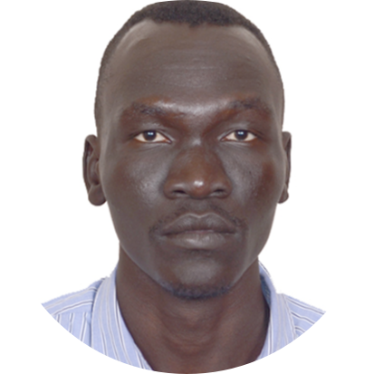

<!DOCTYPE html>
<html/>
<head>
<meta charset="utf-8">
<title>dchol web</title>
<body>
    
<h1>Daniel Simon Chol Aguek</h1>

<em>
<a href="https://www.iitism.ac.in/">Indian Insitite of technology(ISM),Dhanbad</a>

    
<a href="https://www.iitism.ac.in/index.php/Departments/dept_pe">Department of Petroleum Engineering</a>

    
6th semester 

    
International Hostel

    
826004,Dhanbad

    
I'm student at IIT(ISM) dhanbad ,currently pursing becholar of petroleum engineering ,6th semeseter,the reason 
        behind choosing this course is to learn how to implement the latest known technology in Drilling ,production and reservoir enhancement in away that 
        the Enviroment is not destoryed.coming from these areas where oil is explored and produced ,i have seen lots of misuse 
        and misimplemtaion of safty measures both to the enviroment and the local residents ,which is causing a risky dreadful
      hazard,poor GGC waste disposals which is a reslut of unwillingness of finding new applied methods
        used currently in this industry.
        Secondly,increasing production,this lies as a national concern more than it being mine.for the good use of these God given natural 
        resourses maximum,can yield in building up a stronge economy for country ,lifting people from poverty 
        and growing a healthy sustainable economy. 
    

</em>

<h3>Education</h3>

    <ul>
        <table>
            <thead>
                <tr>
                    <th>Date</th>
                    <th>School</th>
                    <th>Period</th>
                    <th>certificate</th>
                </tr>
            </thead>
            <tbody>

            </tbody>
            <tfoot>
                <tr>
                    <td>2008-2011</td>
                    <td>Alqiyda Secondary</td>
                    <td>3 years</td>
                    <td>Sudan Certificate</td>
                </tr>
                <tr>
                    <td>2013-2014</td>
                    <td>Juba University</td>
                    <td>2 semesters</td>
                    <td>Geology and Mining</td>
                
                </tr>

                <tr>
                    <td>2016-2021</td>
                    <td>Indian Institute of Technology(ISM) Dhanbad </td>
                    <td>10 semester</td>
                    <td>Petroleum Engineering</td>
                </tr>

            </tfoot>

            

        </table>

    </ul>
    <h2>Skills</h2>
    <ol>
    
        <li>Computer Programing :
            C++        </li>
        <li>Web Design :
           <em> Html
            CSS,
            Java script
            </em>
        </li>
        <li>Communication Skills</li>
        

    </ol>
    <h2>Hobbies</h2>
    <ol>
        <li><a href="https://www.instagram.com/p/BvhMrpjn92X/?utm_source=ig_web_copy_link">Writting</a></li>

       <li><a href="https://www.instagram.com/p/B66_2f3Hi8T/?utm_source=ig_web_copy_link">Basketball</a></li>
        
    </ol>

<a href="web development3.html">Contact Us</a>

</body>
</html>
